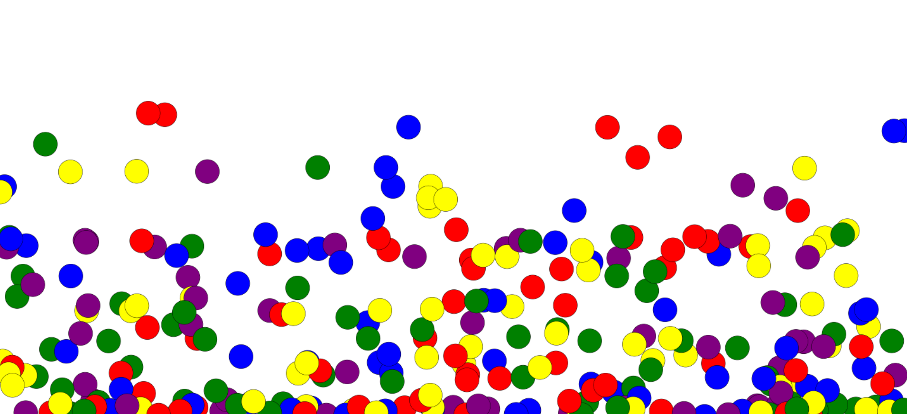

# Gravity-Animation-using-Canvas-HTML-JavaScript

<body>
    <h1>Gravity Animation Description</h1>
    
   
Welcome to the Gravity Animation repository! This project showcases an interactive simulation of gravity using HTML, CSS, and JavaScript. Explore the fascinating world of physics as you witness balls falling under the influence of gravity in a dynamic and engaging animation.

   

        <h2>Key Features:</h2>
        <ul>
            <li>Realistic Gravity Simulation: Experience an accurate depiction of gravitational forces acting on objects as they fall and interact with each other.</li>
            <li>Interactive Interface: Engage with the animation through intuitive controls and responsive user interactions.</li>
            <li>Customizable Parameters: Adjust various parameters such as initial velocity, object mass, and gravitational strength to explore different scenarios and observe their outcomes.</li>
            <li>Educational Tool: Serve as an educational resource for students, educators, and enthusiasts interested in learning about gravity and physics in an interactive manner.</li>
        </ul>
    

   

        <h2>How to Use:</h2>
        <ol>
            <li>Clone the Repository: Clone the repository to your local machine using Git.</li>
            <li>Open HTML File: Simply open the HTML file in your preferred web browser to launch the interactive gravity simulation.</li>
            <li>Explore Gravity Effects: Observe how objects behave under the influence of gravity and experiment with different settings to understand its impact.</li>
        </ol>
    

   div class="technologies-used">
        <h2>Technologies Used:</h2>
        <ul>
            <li>HTML5</li>
            <li>CSS3</li>
            <li>JavaScript</li>
        </ul>
    

   

        <h2>Contributing:</h2>
        
Contributions to enhance the functionality, optimize performance, or improve the user experience are warmly welcomed. Please follow the guidelines outlined in the repository to contribute effectively.

    

   

        <h2>License:</h2>
        
This project is licensed under the MIT License. Feel free to use, modify, and distribute the code as per the terms of the license.

    

</body>
</html>

